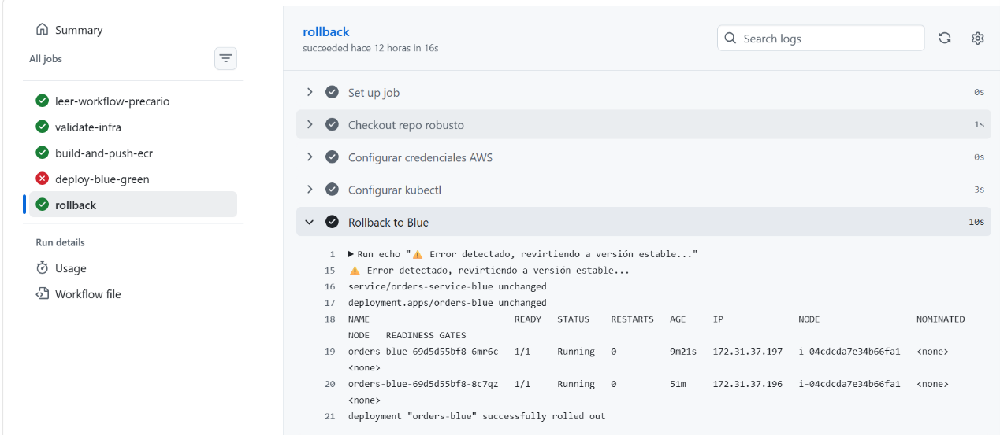
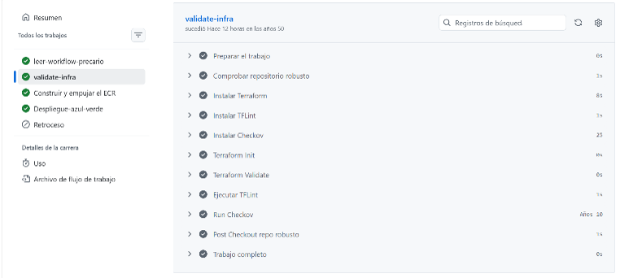
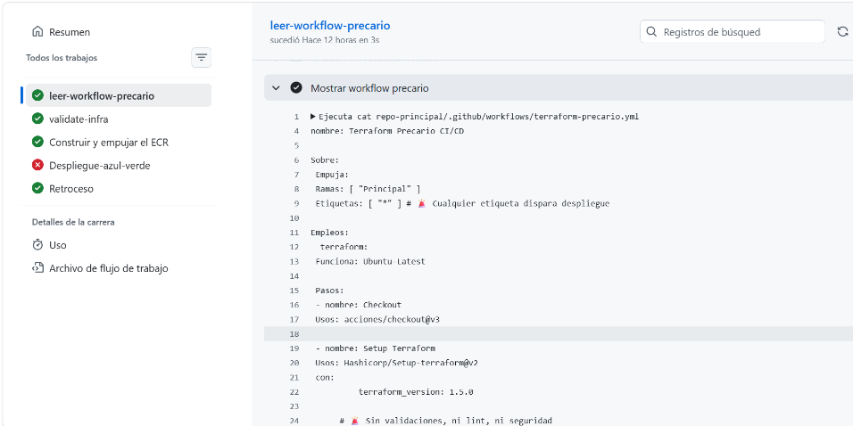
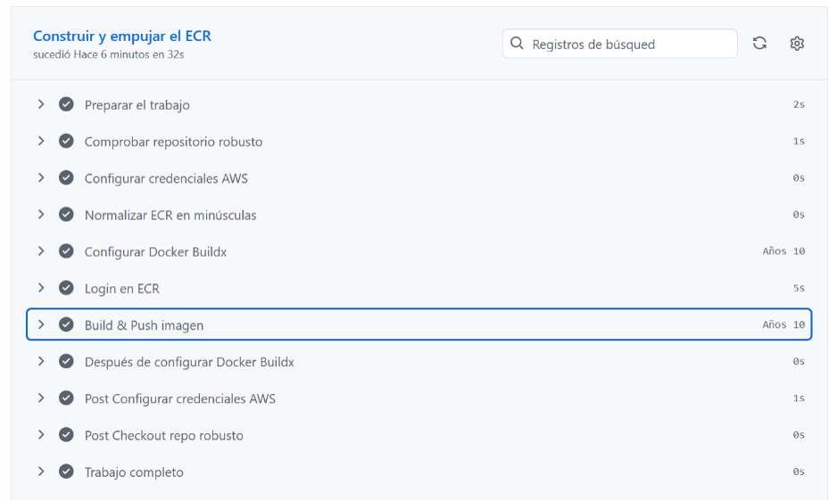
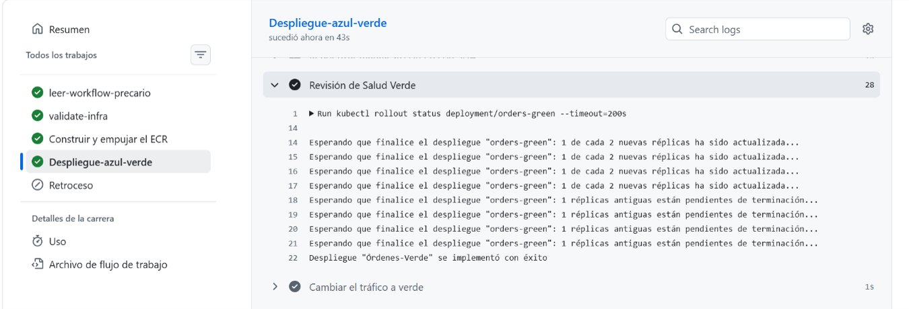
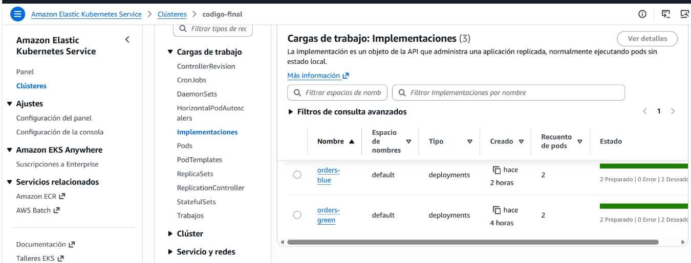
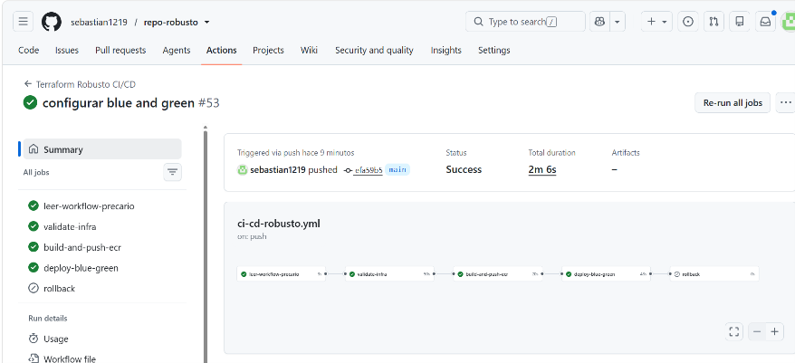
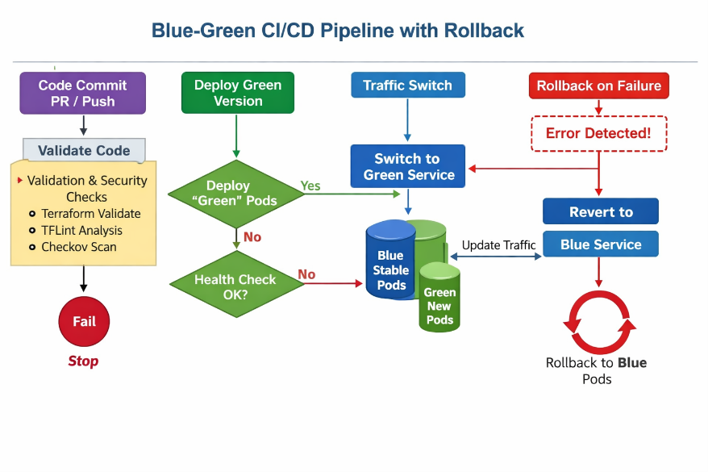
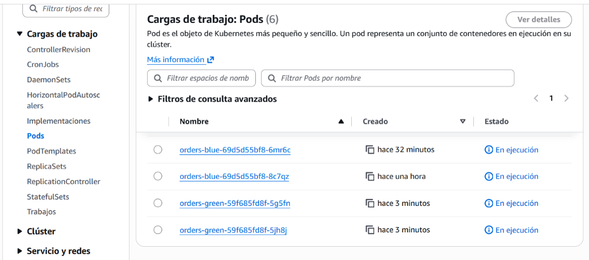
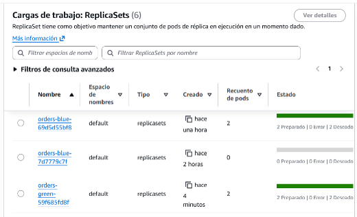

Qué hace este workflow

Validaciones: corre terraform validate, tflint y checkov.

Despliegue Blue-Green: crea un deployment-green, valida su salud y luego cambia el tráfico.

Rollback automático: si falla la validación o el despliegue, revierte a la versión estable (blue).

Separación de etapas: primero validación, luego despliegue, luego rollback si es necesario.

Relación entre repos

Repo central (precario): contiene el pipeline inseguro (terraform-precario.yml).

Repo robusto: contiene este workflow (ci-cd-robusto.yml) con validaciones y resiliencia.

En la defensa, muestras cómo pasaste de un pipeline precario → a uno robusto en otro repo, cumpliendo con el laboratorio.

Cómo cumple con el laboratorio

Validaciones: Terraform, TFLint y Checkov antes de desplegar.

Despliegue avanzado: Blue-Green con cambio de tráfico controlado.

Health check: valida que la versión Green esté sana antes de redirigir tráfico.

Rollback automático: si falla, vuelve a Blue.

**Manifiestos incluidos: deployments y services para ambas versiones.**

Terraform Robusto CI/CD

Este proyecto implementa una arquitectura de despliegue \*\*Blue‑Green\*\* automatizada en AWS EKS utilizando Terraform, GitHub Actions y ECR.

El objetivo es garantizar despliegues resilientes, reversibles y validados antes de mover tráfico a la nueva versión.

Estructura del pipeline

1. \*\*leer‑workflow‑precario\

&#x20;  **- Importa y muestra el workflow base del repositorio principal para comparación.**

2. \*\*validate‑infra

&#x20;  **- Ejecuta validaciones de infraestructura:**

&#x20;    **- `terraform init` y `terraform validate`**

&#x20;    **- `tflint` para linting de código Terraform**

&#x20;    **- `checkov` para análisis de seguridad**

3. \*\*build‑and‑push‑ecr

&#x20;  **- Construye la imagen Docker desde `./manifiestos/Dockerfile`**

&#x20;  **- Etiqueta y sube dos versiones al repositorio ECR:**

&#x20;    **- `${GITHUB\_SHA}` → usada por el despliegue \*\*Green\*\***

&#x20;    **- `stable` → usada por el despliegue \*\*Blue\*\***

&#x20;  **- Usa `docker buildx` y autenticación AWS segura.**

**4. deploy‑blue‑green

&#x20;  **- Actualiza el contexto de `kubectl` con el cluster EKS.**

&#x20;  **- Crea un secreto `ecr‑registry‑helper` para autenticación de imágenes.**

&#x20;  **- Renderiza el manifiesto `deployment‑green.yaml` reemplazando `${GITHUB\_SHA}`.**

&#x20;  **- Aplica el despliegue Green y verifica su estado.**

&#x20;  **- Cambia el tráfico al servicio Green si todo está correcto.**

**5. rollback

&#x20;  **- Si el despliegue falla, aplica automáticamente los manifiestos Blue (`deployment‑blue.yaml` y `service‑blue.yaml`).**

&#x20;  **- Verifica el estado del rollback y muestra los pods activos.**

**## 📦 Requisitos**

**- AWS CLI configurado con permisos para ECR y EKS.**  

**- Repositorio ECR: `637423638685.dkr.ecr.us-east-1.amazonaws.com/ciclo-final`**  

**- Terraform ≥ 1.5.0**  

**- GitHub Actions con secretos:**

&#x20; **- `AWS\_ACCESS\_KEY\_ID`**

&#x20; **- `AWS\_SECRET\_ACCESS\_KEY`**

&#x20; **- `AWS\_SESSION\_TOKEN`**

&#x20; **- `AWS\_REGION`**

&#x20; **- `CLUSTER\_NAME`**

&#x20; **- `ECR\_REPO`**

Flujo de despliegue

1. Commit en rama `main` → dispara el workflow.

2. Se valida la infraestructura.

3. Se construye y sube la imagen a ECR.

4. Se despliega Green con el SHA actual.

5. Si pasa el health check, se redirige el tráfico.

6. Si falla, se ejecuta rollback automático a Blue.

Notas técnicas

**- `revisionHistoryLimit` debe estar en el nivel superior de `spec` en los manifiestos.**  

**- Las variables `${GITHUB\_SHA}` se reemplazan dinámicamente antes de aplicar.**  

**- Los probes `/health` garantizan readiness y liveness.**  

**- El pipeline usa `docker/setup-buildx-action@v3` para compatibilidad con Node 24.**

**## ✅ Estado actual**

**Última ejecución: \*\*Éxito\*\***  

**Duración total: \*\*2m 6s\*\***  

**Commit: \*\*EFA59B5\*\***  

**Branch: \*\*Principal\*\***

